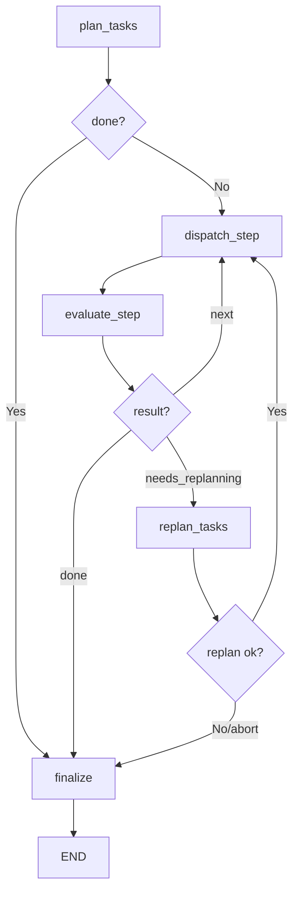
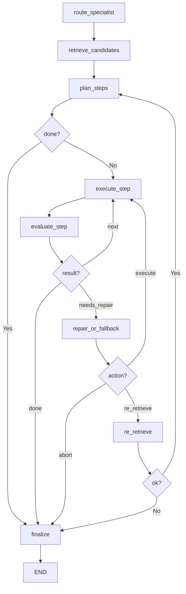

# ai-config アーキテクチャガイド

## システム全体構成

ai-config は以下の主要モジュールで構成されています。

```
src/ai_config/
├── mcp_server/      # 動的選択 MCP サーバー
├── registry/         # ツール登録・インデックス構築
├── retriever/        # ハイブリッド検索エンジン
├── orchestrator/     # LangGraph ベースのオーケストレーション
├── executor/         # ツール実行エンジン
├── dispatch/         # マルチエージェント・ディスパッチ
├── vendor/           # skill import/update/provenance の vendor layer
├── build_index.py    # インデックス構築 CLI
└── source_manager.py # MCP-only source 管理 / legacy cleanup
```

## モジュール詳細

### 1. Registry（ツール登録）

スキルや MCP サーバーの情報をパースし、統一的な `ToolRecord` データモデルに変換します。

#### データモデル (`registry/models.py`)

```python
@dataclass
class ToolRecord:
    id: str              # 例: "skill:deep-research", "mcp:firecrawl"
    name: str            # ツール名
    description: str     # 説明文
    source_path: str     # リポジトリ内の相対パス
    tool_kind: str       # skill | skill_script | mcp_server | toolchain_adapter
    metadata: dict       # レイヤー、ドメイン、対象ターゲット等
    invoke: dict         # 実行に必要な設定（コマンド、引数、環境変数等）
    tags: list[str]      # 検索用タグ
```

#### パーサー一覧

| パーサー | 対象 | 入力 |
|---|---|---|
| `skill_parser.py` | スキル | `skills/**/SKILL.md` (frontmatter) |
| `script_parser.py` | スクリプトスキル | `skills/**/scripts/*.py` 等 |
| `mcp_parser.py` | MCP サーバー | `config/master/ai-sync.yaml` |
| `external_mcp_catalog_parser.py` | 外部 MCP カタログ | `skills/external/**/.mcp.json` |
| `path_metadata.py` | メタデータ推定 | ファイルパスからレイヤー・ドメインを推定 |

`skills/external` は引き続き registry の stable scan target です。skill の fetch / pinned materialization / re-import / provenance は vendor layer が担当し、registry 側は scan-only を維持します。

### Vendor Manifest

Phase 2 では `config/vendor_skills.yaml` が curated external skill source の正本です。

- `branch` は tracking metadata
- `ref` は exact pin であり、setup と `sync-manifest` はこれを優先する
- `skills/external` は git submodule ではなく local artifact として扱う
- provenance には `requested_ref` と resolved `commit_sha` を保存する

この構成により、selector/index/retrieval の scan target を変えずに setup 再現性を維持します。

#### インデックスビルダー (`registry/index_builder.py`)

収集した `ToolRecord` を検索可能なインデックスに変換します。

**出力アーティファクト** (`.index/` ディレクトリ):

| ファイル | 内容 | 用途 |
|---|---|---|
| `records.json` | 全ツールレコード (JSON) | マスターデータ |
| `faiss.bin` | ベクトルインデックス or numpy 行列 | セマンティック検索 |
| `bm25.pkl` | BM25Okapi インデックス | キーワード検索 |
| `keyword_index.json` | トークン→ID マッピング | 完全一致検索 |
| `summary.json` | メタデータ (フォーマットバージョン等) | 互換性確認 |

**エンベディングバックエンド**:
- `hash` (デフォルト): 依存なし、高速、近似ベクトル化
- `sentence_transformer`: `intfloat/multilingual-e5-small` モデルによる高品質エンベディング

---

### 2. Retriever（検索エンジン）

**ハイブリッド検索 + RRF** によるツール検索を提供します。

#### 検索フロー

```
クエリ "ESLint の設定"
  │
  ├── セマンティック検索 (ベクトル類似度)
  │     → eslint-config (0.85), lint-setup (0.72), ...
  │
  ├── BM25 検索 (キーワードマッチ)
  │     → eslint-config (8.2), eslint-fix (5.1), ...
  │
  └── キーワード完全一致
        → eslint-config (exact match)
  │
  └── RRF 統合 (k=60)
        → eslint-config (0.049), eslint-fix (0.016), ...
```

#### RRF（Reciprocal Rank Fusion）

各検索手法のランク位置を統合するスコアリング手法:

```
RRF_score(d) = Σ 1 / (k + rank_i(d))
```

- `k = 60` (定数パラメータ)
- 上位にランクされるほど高スコア
- 複数の検索手法で上位なら相乗効果

#### フィルタリング

検索結果に対してフィルタを適用可能:

- `tool_kinds`: ツール種別 (skill, mcp_server 等)
- `targets`: 対象ツール (codex, antigravity 等)
- `capabilities`: 機能 (cli_execution 等)
- `source_repos`: ソースリポジトリ
- `domains`: ドメイン
- `executable_only`: 実行可能なツールのみ

---

### 3. MCP Server（動的選択サーバー）

AI ツールから呼び出される MCP 準拠のサーバーです。

#### 公開ツール

| ツール | 説明 | 引数 |
|---|---|---|
| `search_tools` | 自然言語でツール検索 | `query`, `top_k` (default: 5) |
| `get_tool_detail` | ID でツール詳細取得 | `tool_id` |
| `list_categories` | カテゴリ別の件数一覧 | なし |
| `get_tool_count` | 総ツール数 | なし |

#### 通信方式

- **stdio** トランスポート（標準入出力経由）
- **streamable-http** トランスポート（HTTP 経由）
- AI ツールが JSON-RPC でリクエスト → MCP サーバーが応答

#### Deploy surface

- `ai-config-mcp-server` は既存の full MCP surface です。default transport は `stdio` のまま維持します。
- `ai-config-selector-serving` は Cloud Run 向けの薄い deploy surface です。selector read API だけを HTTP で公開し、executor / downstream MCP bridge は公開しません。
- Cloud Run runtime は `skills/`、`config/`、`.index/` を read-only に参照します。`sync-manifest` と `ai-config-index` は build-time で完了させます。
- `config/vendor_skills.yaml` と `skills/external` stable scan target は変えません。deploy surface を増やすだけで、core ownership は増やしません。

---

### 4. Dispatch（マルチエージェント・ディスパッチ）

LangGraph ベースのステートグラフで、タスクを分解・実行します。
現在は従来の CLI agent 分解に加えて、`OrchestrationPlan` を受け取って承認済み step を dependency order で実行する経路も持ちます。

#### ステートグラフ



#### 主要コンポーネント

| ファイル | 役割 |
|---|---|
| `planner.py` | LLM でタスクを分解、または承認済み plan を実行用 step に正規化 |
| `dispatcher.py` | CLI エージェント呼び出し、または approved plan の tool execution（逐次 / 並列） |
| `evaluator.py` | ステップ結果の評価、リトライ / 再計画要求の判定 |
| `workflow.py` | YAML ワークフロー定義の読み込み・展開 |
| `graph.py` | LangGraph グラフ配線 |
| `state.py` | ステート型定義 |
| `cli.py` | CLI エントリポイント |

#### 並列ディスパッチ

依存関係のないステップを `ThreadPoolExecutor` で並列実行します。

```
Plan: [A(deps=[]), B(deps=[]), C(deps=[A,B])]
  → Batch 1: A, B を並列実行
  → Batch 2: C を実行（A, B の完了後）
```

#### コンテキスト引き継ぎ

各ステップの出力を `.dispatch/<session_id>/` に JSON として保存し、後続ステップのプロンプトに自動注入します。

---

### 5. Orchestrator（オーケストレーション）

ツールの検索 → 計画 → 実行 → 評価 → 修復 を自律的に繰り返す LangGraph グラフです。
CLI の主経路は planning-first で、まず durable な `OrchestrationPlan` を作り、必要なら `--plan-only` で人間確認し、その後 dispatch に plan を渡して実行します。

#### ステートグラフ



#### スペシャリストルーティング

クエリのキーワードから専門分野を判定し、検索結果をフィルタリングします。

| スペシャリスト | キーワード例 | フィルタ |
|---|---|---|
| `software_engineering` | code, bug, test, react, python | engineering ドメイン優先 |
| `data_analytics` | sql, data, dashboard, bigquery | data ドメイン優先 |
| `knowledge_work` | sales, support, marketing | knowledge-work-plugins 優先 |
| `general` | その他 | フィルタなし |

#### Planning-First Artifact

`orchestrator/plan_schema.py` は次の構造化 artifact を定義します。

- `ToolReference`: 選定された Skill / MCP / Adapter の要約
- `PlanStep`: step 単位の目的、依存関係、期待出力、fallback
- `OrchestrationPlan`: 承認可能な全体 plan（`plan_id`, `revision`, `candidate_tools`, `steps`）
- `PlanValidationResult`: 実行前 validation の結果

この artifact により、lookup と planning と execution の責務を分離します。

- MCP Server: `search_tools` / `get_tool_detail` による capability lookup
- Orchestrator: registry-backed plan generation / validation / controlled replan
- Dispatch: 承認済み plan の実行

---

### 6. Executor（実行エンジン）

ツールを実際に実行するアダプター型のエンジンです。

#### アダプター

| アダプター | 対象 | 実行方法 |
|---|---|---|
| `CodexAdapter` | Codex CLI | `codex exec <prompt> --full-auto` |
| `GeminiCliAdapter` | Gemini CLI | `gemini -p <prompt> --yolo` |
| `AntigravityAdapter` | Antigravity | `antigravity --prompt <prompt>` |

#### セキュリティ

- **コマンドホワイトリスト**: 許可されたコマンドのみ実行可能
- **環境変数フィルタ**: 安全な環境変数のみサブプロセスに渡す
- **機密情報マスク**: 出力中の API キー等を自動マスク
- **タイムアウト**: 実行時間の上限設定

---

## データフロー全体図

```
  ソースコード・設定ファイル
         │
         ▼ (パース)
  ToolRecord[] (統一データモデル)
         │
         ▼ (インデックス構築)
  .index/ (records.json, faiss.bin, bm25.pkl, ...)
         │
         ▼ (検索)
  HybridRetriever.search() → SearchHit[]
         │
    ┌────┴──────────────┐
    │                   │
    ▼                   ▼
  MCP Server         Orchestrator
  (AI ツール向け)      (自動実行)
```
