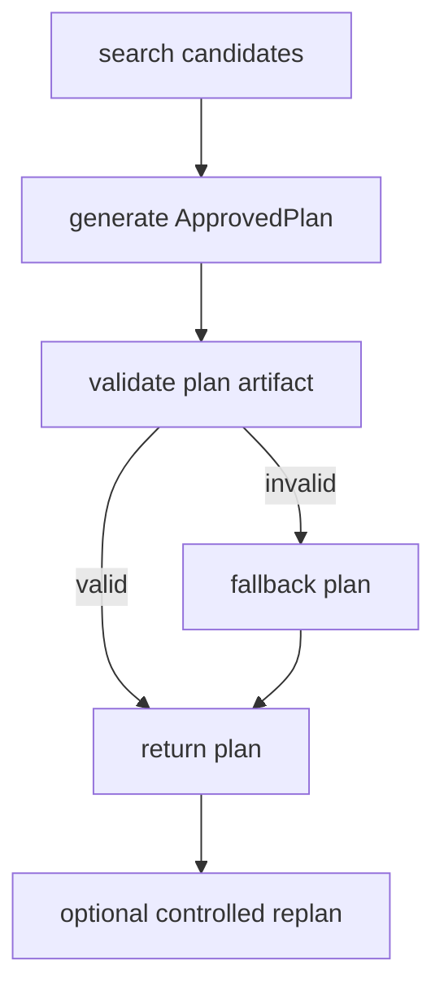

# ai-config アーキテクチャガイド

## Architecture Change Proposal

このリファクタの目的は、`ai-config` を **動的な Skill / MCP 選択に特化した中核基盤** として明確化することです。

方針:

1. `ai-config` は selector / registry / retrieval / planner artifact に集中する
2. Orchestrator は execution 主体ではなく planner library として縮退する
3. Dispatch は approved plan execution runtime として分離可能な境界へ押し出す
4. `ai-config-selector-serving` を標準 deploy surface とする

## Responsibility Model

| Concern | What it means | Owner |
|---|---|---|
| selector | Skill / MCP lookup, ranking, detail lookup, downstream MCP discovery | ai-config |
| planner | candidate retrieval, plan artifact generation, plan validation, controlled replan | ai-config |
| execution boundary | approved plan request contract, subprocess/package boundary, local abstraction | ai-config |
| execution runtime | DAG scheduling, parallelism, retry, context handoff, plan execution | dispatch runtime |

`ai-config` が differentiator として持つのは **正しい候補を出す能力** と **承認可能な plan artifact を作る能力** です。
dispatch runtime は重要ですが、repo の中核責務ではありません。

## Terms

### Selector

`selector` は ToolRecord catalog を検索して候補を返す層です。

- `registry/`
- `retriever/`
- `mcp_server/tools.py`
- `mcp_server/server.py`
- `mcp_server/serving.py`

### Planner

`planner` は selector の候補を使って approved plan artifact を作る層です。

- `orchestrator/planner.py`
- `contracts/approved_plan.py`
- `orchestrator/validator.py`

Planner が行うこと:

- candidate retrieval
- plan artifact generation
- plan validation
- controlled replan

Planner が行わないこと:

- dispatch runtime の内部制御
- dependency DAG 実行
- context handoff の保持戦略

### Execution Runtime

`execution runtime` は approved plan を受け取って実行する層です。

現在は repo 内に compatibility 実装として `dispatch/` が残っていますが、依存方向は次のとおりです。

```text
contracts -> orchestrator/planner
contracts -> dispatch runtime
orchestrator/cli -> executor/plan_boundary -> subprocess/package boundary -> dispatch runtime
```

`ai-config` から `dispatch` を直接 import しないことが設計ルールです。

## Core Modules

```text
src/ai_config/
├── contracts/       # ApprovedPlan / ApprovedPlanExecutionRequest
├── registry/        # ToolRecord normalization and index build
├── retriever/       # hybrid retrieval / RAG
├── mcp_server/      # selector MCP + selector-serving
├── orchestrator/    # planner library and CLI
├── executor/        # tool executor + dispatch boundary adapter
├── dispatch/        # compatibility shim for external runtime package
├── vendor/          # provenance / import / manifest ownership
├── build_index.py
├── doctor.py
└── source_manager.py
```

## Stable Contracts

neutral contract module:

- `ai_config.contracts.approved_plan.ApprovedPlan`
- `ai_config.contracts.approved_plan.ApprovedPlanExecutionRequest`
- `ai_config.contracts.approved_plan.ApprovedPlanExecutionResult`

schema identifiers:

- `ai-config.approved-plan`
- `ai-config.approved-plan-execution-request`
- `ai-config.approved-plan-execution-result`

validation rules:

1. `kind` が期待値に一致すること
2. `schema_version` が `1.x.x` の範囲であること
3. step IDs が一意であること
4. dependency graph が DAG であること
5. plan 中の `tool_id` が available tool record と整合すること
6. `tool_records` を同梱する場合は referenced tool を全て覆うこと
7. execution result の `plan_id` / `plan_revision` / request echo が request payload と一致すること
8. execution result の `status` / `error` semantics が固定ルールに従うこと

JSON schema は CLI から確認できます。

```bash
ai-config-agent schema approved-plan
ai-config-agent schema approved-plan-execution-request
ai-config-agent schema approved-plan-execution-result
```

## Planner Flow



`orchestrator/planner.py` は planning artifact を返すライブラリです。
標準 CLI surface は `search` / `plan` / `execute-approved-plan` を分離します。

## Execution Boundary

`executor/plan_boundary.py` は dispatch runtime を呼ぶ唯一の場所です。

```text
ai-config-agent execute-approved-plan
  -> ApprovedPlanExecutionRequest
  -> DispatchCLIPlanExecutor
  -> python -m ai_config_dispatch.cli --execute-approved-plan <request.json> --json
```

この boundary の利点:

- dispatch の別 repo 化が可能
- ai-config 側の import graph が安定する
- subprocess / package / HTTP どの transport にも移行しやすい
- approved plan request を事前 validation できる
- approved plan result を boundary で reject / accept できる

bootstrap resolution order:

1. `AI_CONFIG_DISPATCH_CMD`
2. sibling repo `../ai-config-dispatch` checkout
3. installed `ai-config-dispatch` CLI
4. in-repo compatibility shim

result contract semantics:

- `success`: completed execution, no top-level `error`, no `replan_request`
- `partial`: controlled replan requested, no top-level `error`
- `error`: runtime failure, top-level `error` required
- `aborted`: intentional stop, top-level `error` required

ownership decision:

- `workflows/*.yaml` は dispatch repo 所有
- runtime docs / troubleshooting / packaging metadata は dispatch repo 所有
- ai-config には contracts / boundary adapter / planner integration docs を残す
- current bootstrap repo は sibling `ai-config-dispatch`
- `src/ai_config/dispatch/*` は compatibility shim のみ残す

## Selector Serving

`ai-config-selector-serving` は selector platform の標準 HTTP surface です。

特性:

- read-only runtime
- build-time index / runtime validation
- `/healthz`
- `/readyz`
- `/mcp`
- startup fail-fast on index contract mismatch

Cloud Run では `skills/`, `config/`, `.index/` を読むだけで、runtime で `sync-manifest` や `ai-config-index` は実行しません。

## Vendor and Ownership

- `config/vendor_skills.yaml` が curated vendor source の正本
- `skills/external` は stable scan target
- vendor provenance は `vendor/` が管理
- registry は scan-only を維持

この分離により、selection quality の改善と provenance 管理を独立に進められます。

## CLI Surfaces

### `ai-config-agent`

- `search`
- `plan`
- `execute-approved-plan`
- `run` (互換・ convenience)
- `schema`

### `ai-config-selector-serving`

- selector read API のみ公開

### `ai-config-dispatch`

- prompt-to-plan runtime と approved plan execution runtime
- separate repo / separate package candidate

## Migration Direction

移行期間の扱い:

1. repo 内 `dispatch/` は compatibility shim として残す
2. `ai-config` は subprocess boundary でのみ呼ぶ
3. contract と CLI を固定した後で別 repo へ移す
4. 将来的に HTTP runtime や external package へ置き換えても `ai-config-agent` 側は変えない

想定 repo split:

```text
ai-config-core
  - contracts
  - selector
  - planner
  - selector-serving

ai-config-dispatch
  - execution runtime
  - DAG / retry / context handoff
  - workflow templates
```

dispatch の次フェーズ計画と assets / docs / packaging の repo 帰属は `docs/dispatch-externalization-plan.md` を参照してください。

## Near-Term Priorities

この設計以降の優先順位は次のとおりです。

1. retrieval / RAG quality
2. selector-serving observability and readiness
3. planner quality
4. dispatch runtime externalization

planner 改善より前に retrieval quality を上げる前提で構成しています。候補 quality が弱い状態で planner だけを強化しても、根本改善にならないためです。
