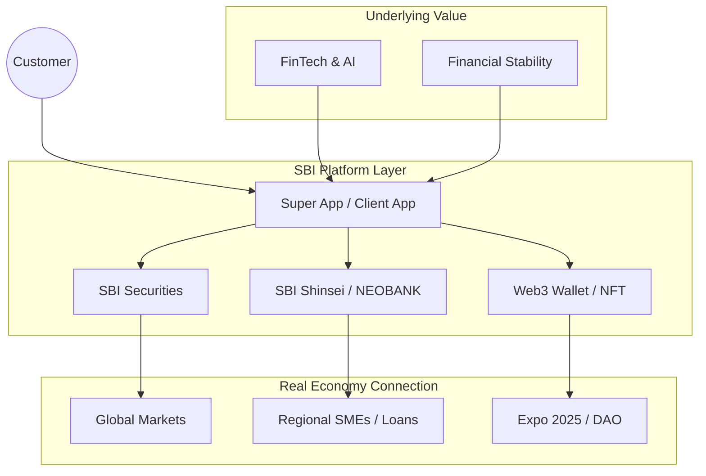

# SBI Ecosystem Map 2025: Strategic Synergy

## 1. The Five Core Pillars
SBIグループの事業は独立しているのではなく、相互に顧客とデータを融通し合う「有機的な生態系」です。

### (1) Financial Services (金融サービス)
*   **SBI Securities**: 証券口座数 No.1。若年層～富裕層まで幅広くカバー。
*   **SBI Shinsei Bank**: 銀行機能のハブ。「コネクト」機能で証券と一体化。
*   **SBI Insurance**: 生損保のネット販売。

### (2) Asset Management (資産運用)
*   **SBI Global Asset**: 低コストインデックスファンドから、オルタナティブ投資まで。
*   **Regional Revitalization AM**: 地方銀行と連携し、地域の資金を地域で運用する循環モデル。

### (3) Investment (投資)
*   **Private Equity**: AI、ブロックチェーン、バイオテックへの積極投資。
*   **CVC (Corporate Venture Capital)**: 投資先技術をグループ内に即実装。

### (4) Crypto-asset / Web3 (次世代金融)
*   **SBI VC Trade / BITPOINT**: 暗号資産交換所。
*   **SBINFT**: NFTマーケットプレイスと発行支援。
*   **Machina X**: 大阪万博NFTなどの社会実装基盤。

### (5) Non-Financial (非金融)
*   **Biotech / Healthcare**: ALA（5-アミノレブリン酸）事業。
*   **Semiconductor (Semi-conductor)**: 国内サプライチェーン再構築支援。

---

## 2. Synergy Patterns (勝ちパターン)

### Pattern A: "The Modern Bank" (地銀連携モデル)
*   **課題**: 地方銀行の収益力低下、DX遅れ。
*   **Solution**:
    *   **銀行アプリ**: SBIのUI/UXをOEM提供。
    *   **証券仲介**: SBI証券の商材を銀行窓口で販売。
    *   **Money Tap**: 銀行間送金コストをゼロに近づける。

### Pattern B: "Corporate DX" (事業会社連携モデル)
*   **課題**: 顧客エンゲージメントの希薄化。
*   **Solution**:
    *   **BaaS (Banking as a Service)**: 小売アプリに銀行機能を埋め込む（NEOBANK）。
    *   **NFT Marketing**: 顧客ロイヤリティをNFTで可視化・永続化する。

### Pattern C: "Asset Formation" (福利厚生モデル)
*   **課題**: 従業員の資産形成支援、採用力強化。
*   **Solution**:
    *   **Corporate DC (401k)**: 低コストな年金制度の導入。
    *   **Investment Education**: 投資教育コンテンツの提供。

---

## 3. Visual Representation (Mermaid)

