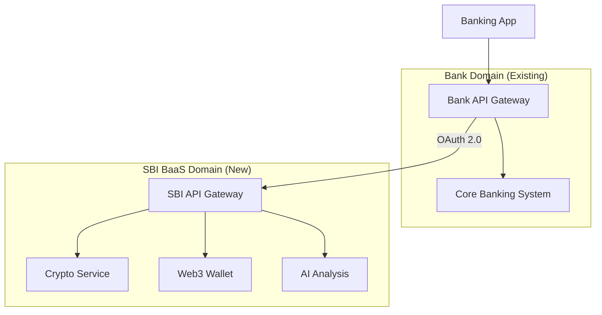

# BaaS Integration Guide: API-First Architecture

**Target:** 地域金融機関 システム部 / CIO
**Concept:** "Do Not Touch the Core" (勘定系には触れない)

## 1. Architecture Overview (疎結合モデル)

## 2. Integration Steps (導入手順)

### Step 1: Authentication (認証連携)
*   **OAuth 2.0 / OpenID Connect**: 銀行側の認証基盤（IdP）を利用し、SBI側は「認可トークン」のみを受け取る。
*   **メリット**: SBI側にパスワードや個人情報（氏名・住所）を持たせる必要がない。

### Step 2: UI Integration (画面組み込み)
*   **Native SDK**: iOS/AndroidアプリにSDKを組み込むだけで、ウォレット画面等を呼び出し可能。
*   **WebView**: より簡易な実装として、アプリ内ブラウザでSBIの画面を表示する（SSO連携）。

### Step 3: Security (セキュリティ)
*   **IP Whitelisting**: 銀行サーバーからのアクセスのみ許可。
*   **mTLS (Mutual TLS)**: 通信経路の相互認証により、中間者攻撃を防止。

## 3. Operations (運用)
*   **Monitoring**: SBI側でAPIのレイテンシ・エラー率を監視し、月次レポートを提供。
*   **Audit Trail**: ユーザーの操作ログは全て記録し、銀行側からの監査要求に即応可能。
